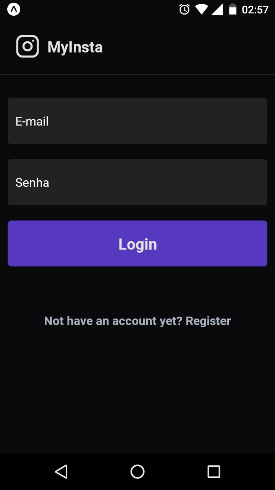
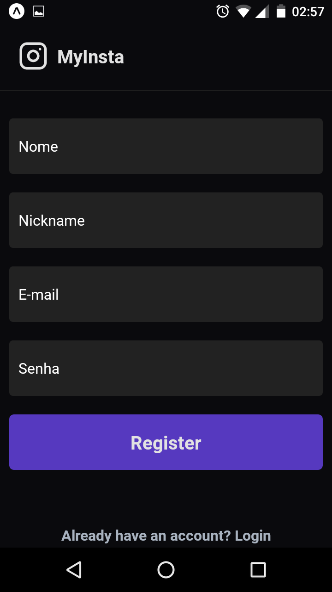
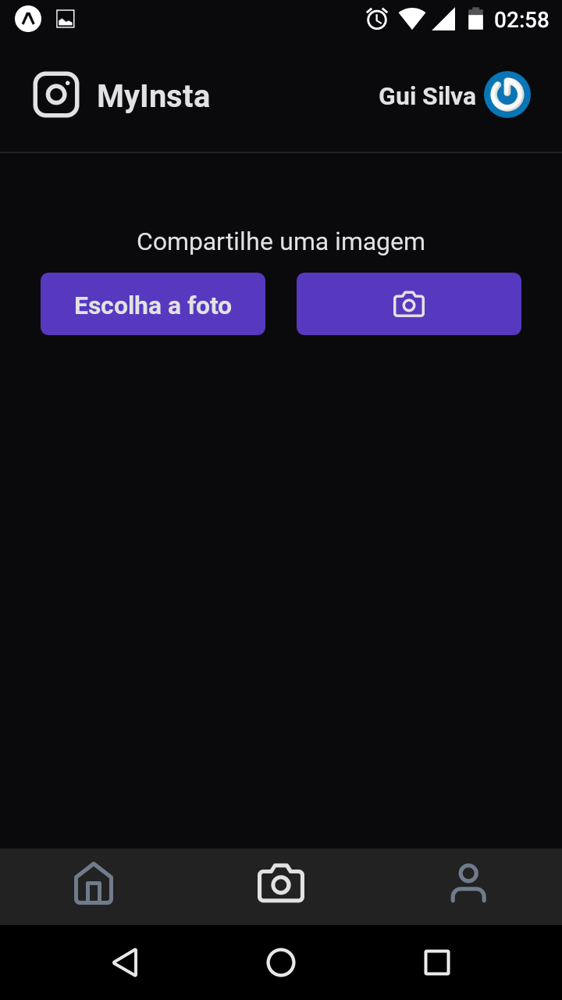
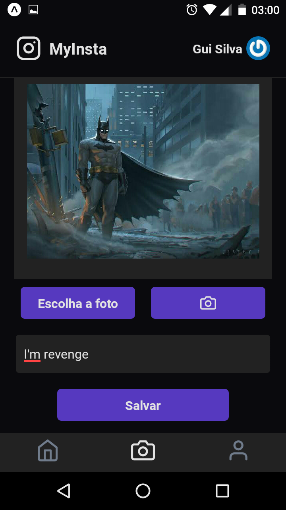

<h1 align="center">MyInsta.</h1>
<p>
Um simples app clone do Instagram, com acesso a <strong>câmera</strong> e
<strong>galeria de imagens</strong> do dispositivo, utilizei também o firebase como backend,
utilizando o <strong>Realtime database</strong>, <strong>firebase storage</strong> e
<strong>firebase authentication</strong> :)
</p>

<p align="left">
  
  &nbsp; &nbsp;
  
  &nbsp; &nbsp;
  
  &nbsp; &nbsp;
  
  &nbsp; &nbsp;
  
  &nbsp; &nbsp;
  
</p>

## Technologies used
  - [React Native](https://reactnative.dev)
  - [Typescript](https://www.typescriptlang.org)
  - [Styled Components](https://www.styled-components.com)
  - [Firebase](https://firebase.google.com/)

## Config used
  - [Eslint](https://eslint.org)
  - [Husky](https://typicode.github.io/husky/#/)
  - [Lint Staged](https://github.com/okonet/lint-staged)
  - [Editor Config](https://editorconfig.org/)

## Getting Started

First, create a web project in [Firebase](https://firebase.google.com/),
and configure the environment variables in the .env file

Second, install all dependencies:

```bash
yarn install
```

Third, run app:

```bash
expo start
```

## Commands

- `start`: runs your application
- `web`: runs your application on `localhost:19002`
- `build`: creates the production build version
- `lint`: runs the linter in all components and pages
- `lint:fix`: runs the linter in all components and pages and fix,
- `lint-staged`: run lint-staged,
- `prepare`: husky install,

Open [localhost](http://localhost:19002/) with your browser to see the result.
